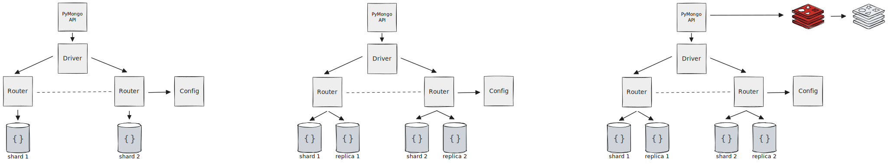
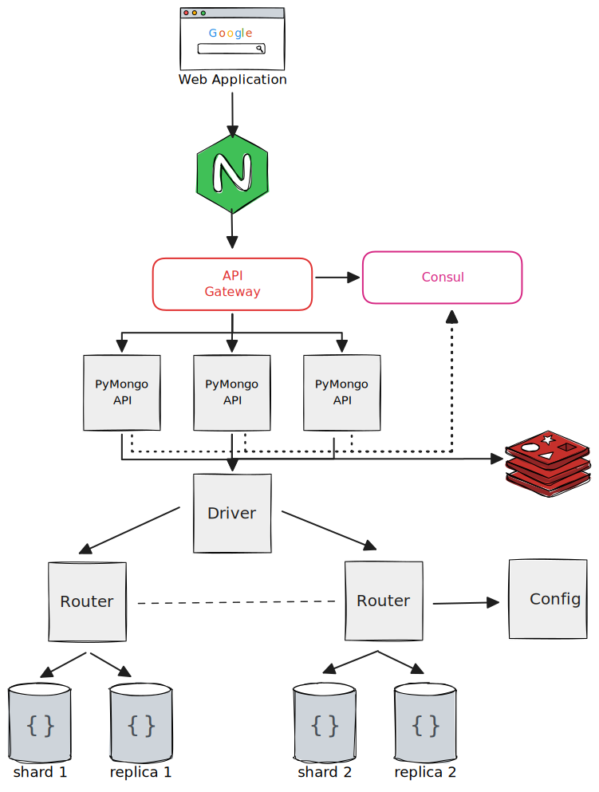
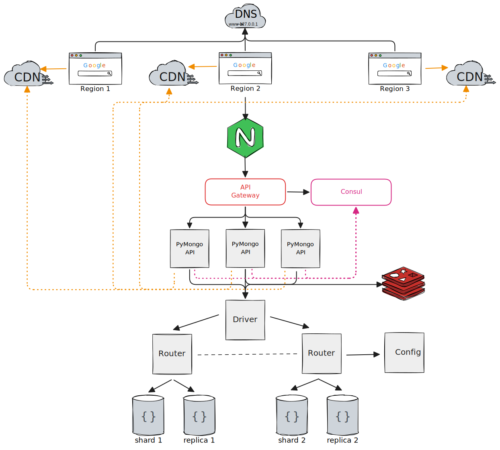
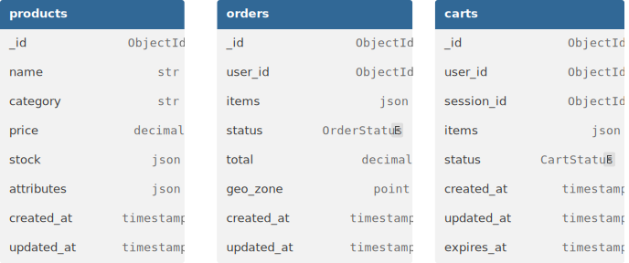

# Отчёт о выполнении

## Задание 1. Планирование

Ваша задача — реализовать шардирование, репликацию и кеширование. Чтобы это сделать, распланируйте изменения.

1. Подготовьте первый вариант схемы. Изобразите, как вы будете использовать шардирование в MongoDB, чтобы повысить
   производительность. Двух шардов будет достаточно.
2. Составьте второй вариант схемы. Изобразите, как будет реализована репликация MongoDB для повышения
   отказоустойчивости. Чтобы это сделать, скопируйте первый вариант схемы и доработайте его, чтобы для каждого шарда
   была настроена репликация. На этом этапе у каждого шарда должно быть по три реплики.
3. И наконец, на третьем варианте схемы изобразите вашу реализацию кеширования, чтобы повысить производительность ещё
   больше. Чтобы это сделать, скопируйте второй вариант схемы и добавьте инстанс Redis для кеширования запросов
   приложения к MongoDB



## Задание 5. Service Discovery и балансировка с API Gateway

Сейчас у онлайн-магазина «Мобильный мир» развёрнут только один инстанс приложения. Это может вызвать простои в случае
перезапуска сайта. Например, при обновлении. К тому же один инстанс может просто не справиться с нагрузкой. Чтобы решить
эту проблему, нужно реализовать горизонтальное масштабирование сайта.

Если запустить несколько инстансов, то непонятно, на какой из них подавать трафик. Для распределения трафика используйте
API Gateway.

Ещё нужно как-то сообщать API Gateway об изменении количества инстансов. Например, что нужно добавить новые инстансы в
балансировку или убрать оттуда удалённые. Чтобы решить эту проблему, используйте Hashicorp Consul для Service Discovery.

Составьте четвёртый вариант схемы, на котором вы покажете реализацию горизонтального масштабирования сайта. Для этого
скопируйте третий вариант, добавив на схему API Gateway для балансировки и Consul для Service Discovery.



## Задание 6. CDN

Чтобы ускорить доставку статического контента пользователям в разных регионах, нужно использовать CDN. Составьте пятый
вариант схемы, на котором вы это реализуете. Для этого скопируйте предыдущий (четвёртый) вариант, добавив на него сервис
CDN в нескольких регионах.



## Задание 7. Проектирование схем коллекций для шардирования данных

Онлайн-магазин «Мобильный мир» сильно вырос, и теперь там можно купить не только аксессуары для смартфонов, но также
электронику, аудио- и бытовую технику и другие категории товаров. Однако бэкенд сайта всё так же состоит из нескольких
микросервисов.

«Мобильный мир» хранит информацию о заказах, товарах и корзинах в трёх коллекциях в MongoDB.

### Коллекция orders включает заказы клиентов и содержит атрибуты:

* Уникальный идентификатор заказа;
* Идентификатор клиента;
* Дату и время оформления заказа;
* Список заказанных товаров и их цену;
* Статус заказа;
* Общую сумму заказа;
* Геозону заказа.

Например, заказ пользователя из Москвы может включать товары из категорий «Электроника» и «Книги».

Основные операции:

* Быстрое создание заказов с одновременным списанием остатков.
* Поиск истории заказов конкретного пользователя.
* Отображение статуса заказа.

### Коллекция products хранит сведения о товарах и включает такие атрибуты:

* Уникальный идентификатор товара;
* Наименование;
* Категорию товара;
* Цену;
* Остаток товара в каждой геозоне;
* Дополнительные атрибуты (цвет, размер).

Например, в Екатеринбурге есть в наличии 50 штук товара «Смартфон X», а в Калининграде — 30.

Основные операции:

* Частые обновления остатков при покупках.
* Поиск товаров по категориям и фильтрация по диапазону цен.
* Описание товара на странице продукта.

### Коллекция carts хранит данные о текущих корзинах (как гостевых, так и пользовательских) и включает атрибуты:

* Уникальный идентификатор корзины (_id);
* Идентификатор пользователя (user_id) и session_id для гостей;
* Список товаров (items): массив документов { product_id, quantity };
* Статус корзины (status): "active" | "ordered" | "abandoned";
* Дату и время создания (created_at);
* Дату и время последнего обновления (updated_at);
* Время удаления (TTL) (expires_at) — для автоматической очистки старых корзин.

Основные операции:

* Создание корзины, когда заходит гость или новый пользователь.
* Получение текущей корзины по фильтру { session_id, status:"active" } или { user_id, status:"active" }.
* Добавление или замена товара в корзине.
* Удаление товара из корзины.
* Слияние гостевой корзины в пользовательскую, если пользователь залогинится:
    * прочитать гостевую { session_id, status:"active" };
    * добавить её items в корзину { user_id, status:"active" };
    * отметить гостевую как abandoned.
* Отметка корзины как заказанной.

### Выполнение:

Спроектируйте схемы коллекций products, orders и carts. Проанализируйте представленные атрибуты коллекций и выберите
потенциальных кандидатов для шард-ключей.



| products                             | orders                             | carts                             |
|--------------------------------------|------------------------------------|-----------------------------------|
|  |  |  |

#### Примеры целевых запросов

- История заказов: `db.orders.find({ user_id: X })` — таргетируется по shard key, если ключ включает `user_id`.
- Активная корзина: `db.carts.findOne({ status: "active", user_id: Y })` — таргетируется по составному ключу; обновления
  корзины также изолируются.
- Каталог: `db.products.find({ category: "Электроника", price: { $gte: 10000, $lte: 20000 } })` — шард‑ключ содержит
  category, что сокращает охват шардов; цена покрывается вторичным индексом.

#### Индексирование помимо шард‑ключей

- **products**: вторичный индекс по price для диапазонных фильтров; комбинированные индексы по популярным фильтрам
  category+price.
- **orders**: индексы по created_at для сортировки истории; по status для трекинга состояния.
- **carts**: уникальный частичный индекс, обеспечивающий одну активную корзину на владельца: { user_id: 1, status: 1 }
  unique с partialFilterExpression: { status: "active" }.

### Итог

- **products**: шардировать по `{ category, product_id: "hashed" }`, а остатки вынести в stock_by_geo с
  ключом `{ geo_zone,
  product_id: "hashed" }` и зонами по geo.
- **orders**: ключ `{ user_id: "hashed" }` (или `{ geo_zone, user_id: "hashed" }` для строгой локализации) для
  таргетируемой истории и равномерности вставок.
- **carts**: материализовать `owner_id = coalesce(user_id, session_id)` и использовать
  ключ `{ status, user_id: "hashed" }`,
  плюс TTL по expires_at с partialFilterExpression на статусы для очистки.

## Задание 8. Выявление и устранение «горячих» шардов

Из-за категории «Электроника» произошла перегрузка одного из шардов MongoDB, так как 70% запросов приходилось именно на
эти товары. Поэтому сейчас нужно разработать стратегию, как выявлять и устранять такие «горячие» шарды, а ещё предложить
метрики мониторинга, чтобы в будущем можно было предотвращать такие ситуации. Не забудьте учесть, что товары из
популярных категорий могут создавать непропорциональную нагрузку на отдельные узлы.

### Что нужно сделать:

* Разработайте набор метрик, чтобы отслеживать состояние шардов.
* Предложите механизмы автоматического перераспределения данных.

### ADR

ADR-001: Выявление и устранение «горячих» шардов MongoDB

Статус: Proposed  
Дата: 2025-11-15

#### Решение (Decision)

Внедрить:

* метрики и алерты для шардов/чанков;
* использование analyzeShardKey для оценки ключа;
* зонирование для разгрузки популярных сегментов;
* плановые окна балансировки и дефрагментации коллекций.

##### 1) Метрики мониторинга (шарды и чанки)

- Нагрузка и задержки: read ops/s, write ops/s, p95/p99 read/write latency, CPU/IO/сеть, WT cache eviction/dirty %,
  lock %.
- Балансировка: число чанков на шард, частота/длительность split/moveChunk, активность балансировщика.
- Здоровье репликации на шардах: replication lag, oplog window, ошибки миграций/копирования.

Пороговые алерты:

- p95 latency шарда > медианы по кластеру на 50%+ в течение ≥5 мин;
- read/write ops дисбаланс >2× между шардами;
- Imbalance чанков: разница >8 чанков (или динамически по порогам) для коллекции;
- длительность миграции > T минут;
- Targeting efficiency <80% (много scatter‑gather);
- рост доли запросов по одному значению shard‑key.

##### 2) Механизмы автоматического перераспределения

- Автодиагностика ключа: регулярный запуск analyzeShardKey и configureQueryAnalyzer для продуктов/каталога, отчёты о
  кардинальности и таргетинге.
- Пред‑split горячих диапазонов: скрипт по событию алерта выполняет sh.splitFind по category=«Электроника» (или
  соответствующему префиксу ключа) для повышения грануляции; затем последовательные sh.moveChunk на менее загруженные
  шарды.
- Зонирование (опция): создать «HOT» зону и перенести горячие диапазоны в выделенные узлы/зону, ограничивая воздействие
  на остальные шарды.

##### 3) Пересмотр шард‑ключа (при системном перекосе)

- Для products: перейти к compound+hashed ключу (например, { category: 1, product_id: "hashed" }) либо отказаться от
  category как первой компоненты для избежания горячей партиции категорий.
- Использовать analyzeShardKey для прогнозирования изоляции запросов и равномерности при новой схеме; спланировать
  миграцию с пред‑split и staged move в окна.

#### Рассмотренные альтернативы

- «Добавить ресурсы на горячий шард»: короткоживущая мера, не устраняет корень проблемы распределения.
- Полная смена шард‑ключа без анализа: высокий риск, т.к. требует простоев/долгой миграции.
- Балансировка «по нагрузке» средствами сторонних агентов: повышает сложность, но всё равно опирается на стандартные
  moveChunk/split.

#### Последствия (Consequences)

- Появляется автоматизированный цикл «обнаружение → пред‑split → moveChunk → валидация», снижающий время жизни «горячих»
  шардов.
- Плановые окна балансировки уменьшают влияние на p95/p99; дефрагментация сокращает время обновления метаданных
  роутинга.
- Пересмотр ключа повышает устойчивость к перекосам, но требует отдельного плана миграции.

## Задание 9. Настройка чтения с реплик и консистентность

Для коллекций products и orders и carts определите:

* Какие операции чтения могут использовать secondary реплику для чтения.
* Какие операции чтения должны читать только с primary.
* Укажите, какая задержка репликации допустима для операций на secondary.

Обоснуйте выбор, опираясь на:

* Требования к консистентности данных.
* Частоту обновлений.
* Бизнес-логику (например, риск продажи недоступного товара или отображение устаревшего статуса заказа пользователю).

### ADR

ADR-002: Определение политик чтения с реплик для collections products, orders, carts

Статус: Proposed  
Дата: 2025-11-15

#### Решение (Decision)

- Для витринных и исторических чтений использовать secondaryPreferred с maxStalenessSeconds 5–15 сек (конкретный SLA
  ниже), снижая нагрузку на primary.
- Для критичных операций (checkout, остатки, финальные цены, актуальный статус заказа) читать только с primary с при
  необходимости readConcern=majority для устойчивости к failover и подтверждённой фиксации.

#### Таблица: операции чтения и источник

| Коллекция | Операция                                        | Источник чтения         | Настройки                                                      | Обоснование                                                   |
|-----------|-------------------------------------------------|-------------------------|----------------------------------------------------------------|---------------------------------------------------------------|
| products  | Каталог: список по категории/цене               | secondary               | readPreference=secondaryPreferred, maxStalenessSeconds=5–15    | Витрина терпит малую устарелость, разгружаем primary.         |
| products  | Карточка товара (описание/атрибуты)             | secondary               | secondaryPreferred, maxStalenessSeconds=5–15                   | Изменяется нечасто, допускается небольшой лаг.                |
| products  | Текущий остаток для кнопки «Купить»             | primary                 | readPreference=primary; при необходимости readConcern=majority | Риск продажи недоступного товара — нужен самый свежий снимок. |
| products  | Цена, используемая в корзине/чекауте            | primary                 | readPreference=primary; возможно readConcern=majority          | Финансовая корректность важнее масштаба чтений.               |
| orders    | История заказов пользователя (листинг)          | secondary               | secondaryPreferred, maxStalenessSeconds=5–10                   | Исторические данные могут устаревать на секунды.              |
| orders    | Детали заказа (просмотр после оформления)       | secondary               | secondaryPreferred, maxStalenessSeconds=5–10                   | Допустим кратковременный лаг статусов/полей.                  |
| orders    | Текущий статус заказа (реал‑тайм трекинг)       | primary                 | primary; для строгих SLA — readConcern=majority                | Избегаем показа устаревшего статуса.                          |
| carts     | Получение активной корзины (user_id/session_id) | primary                 | primary                                                        | Частые изменения.                                             |
| carts     | Предпросмотр корзины без действий               | secondary (опционально) | secondaryPreferred, maxStalenessSeconds=5–10                   | Допустима редкая рассинхронизация в UI без списаний.          |
| carts     | Проверки в checkout (re‑stock, re‑price)        | primary                 | primary; возможно readConcern=majority                         | Критично для корректности заказа.                             |

#### Допустимая задержка репликации (SLO)

- Витрина (каталог/карточки): до 10 сек (диапазон 5–15 сек в зависимости от региона и кэшей), через
  maxStalenessSeconds=10 по умолчанию.
- История/детали заказов (read‑mostly): до 10 сек; при критичных экранах статусов — primary.
- Операции checkout, остатки и цены: 0 сек (только primary). Дополнительно для предотвращения чтений с сильно отстающих
  вторичных включить алерт на replication lag > 10–15 сек и временно принудительно отправлять чтения на primary.

#### Обоснование

- Read preferences управляют маршрутизацией, а read concern управляет тем, насколько подтверждённые данные
  возвращаются.
- Для витрины допуск небольшой устарелости улучшает масштабируемость и снижает нагрузку на primary. Ограничение
  staleness защищает от «холодных» вторичных.
- Операции, влияющие на деньги/склад и пользовательские инварианты (read‑your‑writes), требуют чтения с primary.

#### Мониторинг и алерты

- Метрики: replication lag per secondary, p95/p99 латентность read на secondary vs primary, доля secondary‑ридов, ошибки
  «stale»/routing, доля запросов, перелитых на primary из‑за превышения staleness.
- Алерты: lag > 10–15 сек для наборов с secondary‑чтениями; при срабатывании — временно принудительно route на primary
  до нормализации.

#### Риски и меры

- Риск устаревших данных в UI при secondary — смягчается maxStalenessSeconds и выбором источника по критичности экрана.
- Рост латентности при majority — применять точечно только на критичных путях (checkout/status), избегая повсеместного
  использования.

## Миграция на Cassandra: модель данных, стратегии репликации и шардирования

Во время «чёрной пятницы» интернет-магазин использовал MongoDB с шардированием на основе диапазонов (Range-Based
Sharding).

При резком увеличении нагрузки (50 000 запросов/сек.) возникла высокая задержка при масштабировании.

При добавлении новых шардов MongoDB полностью перераспределяла данные между всеми узлами, что вызывало просадку latency
в пик нагрузки, так как система тратила ресурсы на перемещение данных.

Руководство решило перейти на БД Cassandra, чтобы обеспечить:

* Высокую отказоустойчивость (leaderless‑репликация).
* Быстрое горизонтальное масштабирование без полного перераспределения данных.
* Равномерное распределение данных.

## Задание 10.1

Определите, какие части данных интернет-магазина (например, заказы, товары, корзины, история заказов, пользовательские
сессии) являются критически важными с точки зрения целостности и скорости обработки. Обоснуйте, для каких именно данных
применение Cassandra имеет смысл (учтите требования к масштабируемости, геораспределённости, скорости записи/чтения и
целостности данных).

### ADR-003: Переход от MongoDB (Range Sharding) к Cassandra

Статус: Proposed  
Дата: 2025-11-15

#### Решение (Decision)

- Возможно перенести: корзины, сессии, остатки, каталоги, историю/события заказа.
- Условно перенести: заказы.
- Исключить из переноса: чувствительные данные - профили пользователей и платежные транзакции.

**Корзины (carts)**

- Критичность: высокая скорость записи/чтения, всплески, TTL очистка; eventual consistency допустима до checkout.
- Почему Cassandra: быстрые upsert с TTL, равномерное распределение по user_id, линейное масштабирование под пик.

**Пользовательские сессии (sessions)**

- Критичность: низкая задержка, TTL, высокая кардинальность ключей.
- Почему Cassandra: key‑value паттерн, дешёвые записи, TTL на уровне записи.

**Остатки по гео-зонам (stock by geo)**

- Критичность: высокая скорость обновлений, гео-локальные чтения; критична свежесть перед оформлением.
- Почему Cassandra: партиционирование по (geozone, product_id), локальные чтения в DC, QUORUM на критичных путях.

**Продукты (products — витрина/каталог)**

- Критичность: массовые чтения, кэшируемость, предсказуемые запросы (по id и категориям/цене).
- Почему Cassandra: денормализация под запросы, bucketing для популярных категорий, масштабирование без тотального
  ребалансинга.

**История заказов / события заказов (order events/history)**

- Критичность: write‑heavy append, ленты по user_id/order_id, аналитика и аудит.
- Почему Cassandra: time‑series/append‑only, крупные партиции можно контролировать по timeuuid/бакетам.

**Заказы (orders — оформление/биллинг)**

- Критичность: строгие инварианты, согласованность цен/остатков/статусов.
- Почему Cassandra: возможно с LOCAL_QUORUM/QUORUM и идемпотентностью; однако предпочтительно оставить в системе с
  транзакциями или разделить: оперативные статусы/кэш — в Cassandra, источник истины — в транзакционной БД.

#### Рассмотренные альтернативы

- **Улучшение шардирования в MongoDB**
    - Что: переход с range-based на compound+hashed шард‑ключи (например, {category, product_id hashed}), пред‑сплиты,
      уменьшение chunk size, зоны по географии, кэширование уровня каталога, CQRS‑проекции под горячие запросы.
    - Плюсы: сохраняется текущая технологическая база и экосистема; ниже стоимость миграции.
    - Минусы: при экстремальном росте и динамике топологии остаются риски миграций чанков в пиковые периоды; требуется
      дисциплина ключей и постоянный мониторинг «горячих» диапазонов.

- **Перенос только витринных чтений в кэш/поисковый движок**
    - Что: агрессивное CDN/edge‑кэширование витрины, Redis/KeyDB для горячих карточек, Elasticsearch для фильтров
      каталога.
    - Плюсы: снимает значительную часть read‑нагрузки без смены основного хранилища; быстрый TTV(time to value).
    - Минусы: сложнее согласованность (invalidation, TTL), дополнительная операционная сложность; не решает
      write‑горлышки и ребалансинг данных в первичной БД.

#### Последствия (Consequences)

- Линейное горизонтальное масштабирование и частичный ребаланс при добавлении узлов, что минимизирует просадки latency в
  пик.
- Равномерное распределение ключей через продуманные partition keys и bucketing, снижение риска «горячих» партиций.
- Усиленная согласованность (LOCAL_QUORUM) для остатков/критичных путей.

#### Минусы и риски:

- Денормализация «под запросы» и дублирование данных повышают сложность схем и процессов поддержки.
- Требуются эксплуатационные процедуры (repair/инкрементальные репейры, контроль tombstones, настройка gc_grace,
  мониторинг размеров партиций и p99).
- Командные компетенции: обучение CQL, operational runbooks, алертинг по CL‑ошибкам и бэкап/восстановление.
- Появляется необходимость в платформенных практиках SRE для распределённых систем (capacity planning, chaos‑тесты,
  нагрузочные профили под «чёрную пятницу»).
- Перестройка данных и интеграций: двойная запись, стрим‑репликация (CDC/шина событий) и механизм валидации
  консистентности между системами.

## Задание 10.2

Разработайте концептуальную модель для выбранных критически важных сущностей.
Определите partition key и кластерные ключи для каждой сущности, объяснив, как они будут обеспечивать равномерное
распределение данных и эффективный доступ в условиях экстремальной нагрузки.
Обоснуйте выбор модели с точки зрения возможных «горячих» партиций и минимизации влияния решардинга при изменении
топологии кластера.

### ADR

#### ADR-004: Построение концептуальной модели в Cassandra

Статус: Proposed  
Дата: 2025-11-16

#### Принципы моделирования

- Ключ под запрос: каждая таблица оптимизируется под конкретный паттерн чтения/записи; избегать запросов через множество
  партиций.
- Контроль размера партиции: держать партиции «малыми» (ориентир до 100 МБ), применять time‑/hash‑bucketing для
  предотвращения роста и «горячих» ключей.
- Кластеризация по доступу: clustering keys задают порядок в партиции (обычно по времени или цене), минимизируя сканы и
  обеспечивая нужную сортировку.

##### Products — детальная карточка

- равномерное распределение по hash(product_id);
- точечный доступ без сканов;
- низкая вероятность «горячей» партиции, т.к. ключ высоко кардинальный.

```sql
CREATE TABLE products_detail
(
    product_id text,
    name       text,
    category   text,
    price      decimal,
    attrs      map<text,
    text>,
    updated_at timestamp,
    PRIMARY KEY ((product_id)
)
    );
```

Риск «горячего» ключа: минимален; популярные продукты кешируются на edge/приложении, не создавая дисбаланса на уровне
партиции.

##### Products — каталог по категории и цене

`bucket = hash(product_id) % N(настраиваивается)`

- добавление bucket в partition key «веерит» популярные категории по множеству партиций, снимая «горячие» партиции;
- кластеризация по price поддерживает диапазонные фильтры внутри партиции.

```sql
CREATE TABLE products_catalog
(
    category   text,
    bucket     int,
    price      decimal,
    product_id text,
    name       text,
    attrs      map<text,
    text>,
    PRIMARY KEY ((category, bucket),
    price,
    product_id
) ) WITH CLUSTERING ORDER BY (price ASC, product_id ASC);
```

Меры против «горячих»: динамическое увеличение N (двойная запись в старые/новые бакеты на время миграции) и ограничение
объёма партиции <100 МБ.

##### Stock — остатки по геозонам

- распределение по geo_zone и product_id равномерно рассеивает нагрузку;
- локальные чтения в DC уменьшают латентность;
- обновления атомарны в пределах строки.

```sql
CREATE TABLE stock_by_geo
(
    geo_zone   text,
    product_id text,
    qty        int,
    updated_at timestamp,
    PRIMARY KEY ((geo, product_id)
)
    );
```

Риск «горячего»: поп‑продукт в одном geo_zone даёт нагрузку на одну партицию; смягчается кэшем/рейтом лимитом на write,
а при экстремальных пиках — добавлением временного write‑bucketing.

##### Carts — активная корзина владельца (частые read/write, TTL)

`owner_id = coalesce(user_id, session_id)`

- вся активность корзины владельца локализуется в одной партиции;
- быстрый поиск active по верхнему кластеру;
- TTL применим на уровне строк/полей.

```sql
CREATE TABLE carts_by_owner
(
    owner_id   text,
    status     text,     -- active|ordered|abandoned
    updated_at timeuuid, -- для сортировки по времени DESC
    cart_id    text,
    items      text,     -- или коллекции/UDT
    ttl_until  timestamp,
    PRIMARY KEY ((owner_id),
    status,
    updated_at
) ) WITH CLUSTERING ORDER BY (status ASC, updated_at DESC);
```

Риск «горячего»: high‑traffic пользователей создают горячие партиции; смягчается тем, что нагрузка распределена по
множеству владельцев; для отдельных «китов» можно внедрить дополнительный hash‑suffix к owner_id.

### Sessions — сессии пользователей (key‑value, TTL)

- высокий кардиналитет session_id → равномерное распределение;
- TTL на запись для авто-очистки.

```sql
CREATE TABLE sessions
(
    session_id text,
    user_id    text,
    data       text,
    expires_at timestamp,
    PRIMARY KEY ((session_id)
) ) WITH default_time_to_live = 0;
```

### Order events/history — лента событий заказа/пользователя (append‑only)

`day_bucket = toDate(event_time) или часовой bucket для высоких RPS`

- time‑bucketing предотвращает неограниченный рост партиции и «горячие» ключи при всплесках;
- timeuuid/ts обеспечивает сортировку и эффективные чтения последних событий.

```sql
CREATE TABLE order_events_by_user
(
    user_id    text,
    day_bucket date,
    event_time timeuuid,
    order_id   text,
    type       text,
    payload    text,
    PRIMARY KEY ((user_id, day_bucket),
    event_time,
    order_id
) ) WITH CLUSTERING ORDER BY (event_time DESC, order_id ASC);
```

## Риски и меры

- Риск аномально высокого трафика: ввод hash‑suffix к owner_id/product_id для веерного распределения; адаптивное
  увеличение N в bucket.
- Риск роста партиций: регулярный аудит размера партиций, ограничение TTL/retention для историй и событий; переразбиение
  bucket’ов с двойной записью в переходный период.
- Риск сложной денормализации: строгие контракты записи «под запросы», автоматизированные тесты согласованности между
  проекциями.

## Задание 10.3

Какие стратегии (Hinted Handoff, Read Repair, Anti-Entropy Repair) можно применить для обеспечения целостности данных?
Для каких сущностей вы выберете одну стратегию, а для каких — другую?
Обоснуйте свой выбор с учётом компромиссов между latency запросов и уровнем гарантии согласованности.

### ADR-005: Стратегии обеспечения целостности данных в Cassandra

Статус: Proposed  
Дата: 2025-11-15

#### Решение (Decision)

Использовать комбинированный подход:

* Hinted Handoff включён кластерно для устойчивости к кратковременным отказам
* Read Repair — точечно на таблицах с высоким объёмом чтений и требованием свежести
* Anti‑Entropy Repair — регулярный инкрементальный ремонт всех ключспейсов до истечения gc_grace_seconds.

**Применение по сущностям**

- carts_by_owner (корзины): Hinted Handoff включён; Read Repair — минимальный/по умолчанию; обязательный периодический
  incremental repair, чтобы выровнять расхождения без роста p99 чтений.
- sessions (сессии): Hinted Handoff; Read Repair не усиливать из‑за высокой чувствительности к латентности; регулярный
  repair по расписанию и TTL‑очистка на записи.
- stock_by_geo (остатки): Hinted Handoff; Read Repair умеренный (повышенный для read‑интенсивных зон), Anti‑Entropy
  Repair чаще обычного, чтение/запись на LOCAL_QUORUM для свежести остатков.
- products (витрина: by_id, by_category): Hinted Handoff; небольшой Read Repair chance для самоисцеления при массовых
  чтениях; repair по стандартному циклу, так как изменения редки.
- order_events_by_user (события/история): Hinted Handoff; упор на Anti‑Entropy Repair по расписанию; Read Repair не
  усиливать, чтобы не увеличивать p99 чтений на больших лентах.
- orders_by_id (статусы заказов): Hinted Handoff; Read Repair умеренный; регламентный repair, чтения/записи на
  LOCAL_QUORUM/QUORUM для критичных экранов статусов.

**Обоснование выбора и компромиссы**

- Hinted Handoff: компенсирует кратковременную недоступность реплик, снижая write‑фейлы и обеспечивая последующую
  доставку, что особенно важно под пиковыми нагрузками и сетевыми флапами.
- Read Repair: повышает свежесть при чтениях за счёт сравнения и починки реплик, но может увеличивать латентность чтений
  и сетевую нагрузку, поэтому применяется точечно там, где свежесть важнее p99 (например, остатки).
- Anti‑Entropy Repair: надёжный способ глобально выровнять все реплики (включая «холодные» ключи), обязателен до
  истечения gc_grace_seconds, иначе риск «воскрешения» удалённых данных и роста tombstones.

#### Рассмотренные альтернативы

- Усиление консистентности без смены стратегий
    - Что: повысить уровни CL на чтениях/записях (LOCAL_QUORUM/QUORUM), оставить Hinted Handoff и минимальный Read
      Repair, полагаться на регулярный Anti‑Entropy Repair.
    - Плюсы: простая эксплуатация, предсказуемая латентность, меньше «скрытых» затрат на сетевые починки при чтении.
    - Минусы: выше стоимость каждого запроса при повышенном CL; при редких чтениях «холодных» ключей возможна
      долговременная рассинхронизация до планового repair.

- Вынос критичных чтений в кэш уровня приложения
    - Что: front‑кэш/Redis для статусов и остатков с фоновой валидацией и компенсациями.
    - Плюсы: минимальная латентность, разгрузка базы, сглаживание пиков.
    - Минусы: сложнее инвалидация, риск serve‑stale; всё равно требуется базовая стратегия согласованности в Cassandra.

## Минусы и риски

- Повышение латентности при Read Repair
    - Read Repair добавляет сетевые round‑trip’ы и сравнение реплик на критичных путях, что ухудшает p95/p99 под пиком.
    - Митигировать точечным включением: держать низким для carts/sessions и выше — для inventory/orders‑status, где
      свежесть важнее.

- Операционная сложность и компетенции
    - Команде нужны навыки эксплуатации hinted handoff очередей, чтение метрик read‑repair/repair, планирование
      GC/tombstones.
    - Без зрелого SRE‑процесса возрастает риск инцидентов при масштабировании и в пиковые события.

- Согласованность кэшей и межсистемная целостность
    - При использовании кэшей/CDN и гибридных хранилищ возникают сложности инвалидации и разъездов данных.
    - Нужны чёткие политики TTL, idempotency, CDC/валидаторы консистентности и алерты на расхождения.
